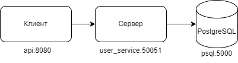

# UserService

UserService - это клиент-серверное приложение. Оно показывает как работает микросервисная архитектура на простом примере.

Ниже представлена схема приложения:




Также при запуске контейнера с базой данных предусмотрены `health-check`, так чтобы остальная часть приложения не запустилась пока бд не поднимется. Так же не поднимется `api`, если не поднят `user_service`.

## Технологии
Приложение написано на языке программирования Go.
Использованные технологии:
* Go
* gorilla/mux
* Docker (Docker-compose)
* PostgreSQL
* Git
* Make
* gRPC
* Goose

### Клиент
Клиент - это web-приложение написанное по практикам restapi. Также оно запускается в отдельном docker-контейнере, что позволяет изолировать его от внешнего воздействия. Для доступа к серверу используются протобафы, которые лежат `/API/proto/gen`. Конфиги насположены по путю `/API/config/local.yaml`. Тажке есть логер `log/slog` и поверх него написана обертка для удобной визуализации.

### Сервер
Клиент - это приложение написанное с помощью фреймворка gRPC. Для работы использует протобафы, которые лежат по пути `/API/proto/gen`. Есть миграции написанные на `goose`. Конфиги также насположены по путю `/API/config/local.yaml` и есть логер `log/slog`, поверх него написана обертка для удобной визуализации.


## Хранение данных
Приложение использует базу данных PostgreSQL. Это одна из самых мощных баз данных на сегодняшний день.

## Запуск
Код для запуска этого приложения к docker контейнерах написан в `docker-compose.yml`.
Если у вас установлена утилита `make` то запуск происходит командой:
```
make build-up
```

Если же нет то командой:
```
docker compose up --build
```
